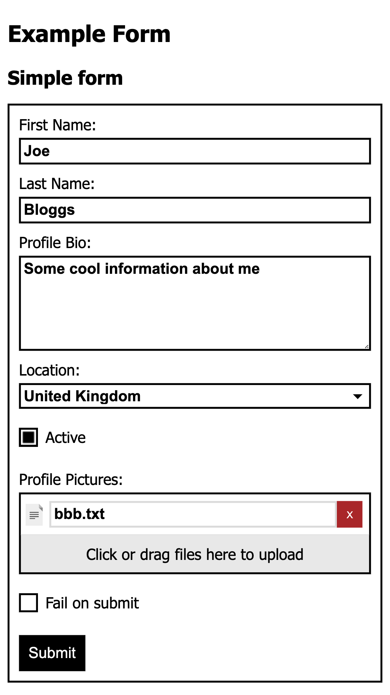

# mithui
A ui library for mithril.

[Live demo](https://mithril-ui.onrender.com/)

## Screenshot


## Available Components
### Forms
### Text Input
```javascript
{
  name: 'firstName',
  label: 'First Name',
  errors: errors.firstName,
  component: mui.textInput,
  autoFocus: true,
  initialValue: 'Joe'
}
```
### Multiline Input
```javascript
{
  name: 'bio',
  label: 'Profile Bio',
  errors: errors.lastName,
  component: mui.multilineInput,
  initialValue: 'Some cool information about me'
}
```

### Select
```javascript
{
  name: 'location',
  label: 'Location',
  errors: errors.location,
  component: mui.select,
  options: [
    {
      value: 'au',
      label: 'Australia'
    },
    {
      value: 'uk',
      label: 'United Kingdom'
    }
  ],
  initialValue: 'uk'
}
```

### Checkbox
```javascript
{
  name: 'active',
  label: 'Active',
  errors: errors.active,
  component: mui.checkbox,
  initialValue: true
}
```

### File Picker
```javascript
{
  name: 'pictures',
  label: 'Profile Pictures',
  errors: errors.picture,
  prefix: '/data/avatars/',
  component: mui.filePicker,
  multiple: true,
  initialValue: [{
    name: 'bbb.txt',
    id: 12
  }]
}
```

## Example Usage
```javascript
const mui = require('mithui');

h(
  'div',
  { class: 'someForm' },
  mithril(mui.form, {
    fields: [{
      name: 'firstName',
      label: 'First Name',
      component: createTextInput,
      autoFocus: true,
      initialValue: 'Joe'
    }, {
      name: 'lastName',
      label: 'Last Name',
      component: createTextInput,
      initialValue: 'Bloggs'
    }
  )
)
```
